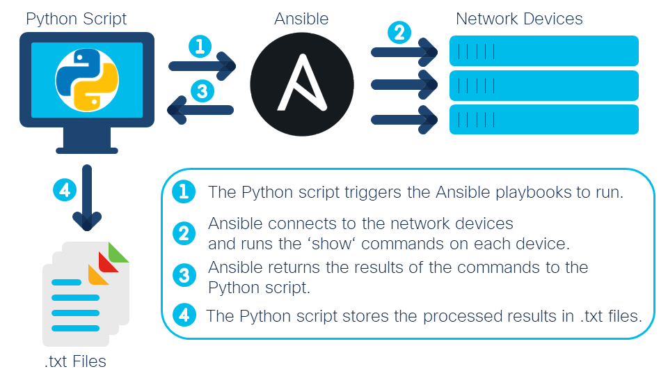
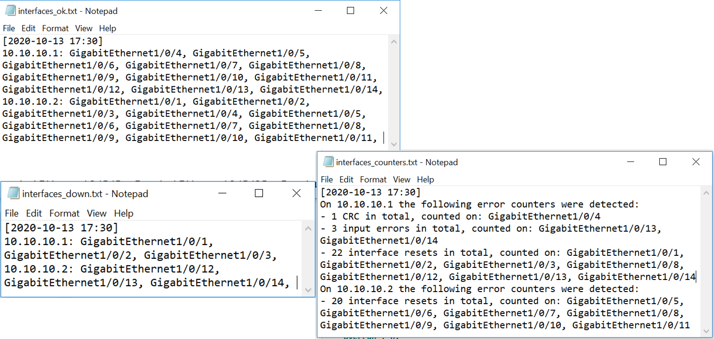

# Network Device Interface Health Check using Ansible

A Python script to quickly check the interface status and statistics of Cisco IOS and IOS XE network devices using Ansible ([watch demo](https://youtu.be/GuE2HDsu03I)).

## Overview
 

**Device/Interface Health**: To get a high-level and quick overview of whether network devices are up and running, the output of the CLI commands "show ip interface brief" and "show interface {{ interface }} | i errors" can provide some insights.  

**Ansible**: Ansible is an open-source tool enabling infrastructure as code and is used in this script to automate running CLI commands on the network devices. 

**Python and the ansible_runner module**: The script is written in Python and makes use of the [ansible_runner](https://ansible-runner.readthedocs.io/en/stable/python_interface.html) module to execute playbooks and to retrieve the output for further processing in Python. 

**Output**: The results of the CLI commands are stored in simple .txt files: 

## Contacts
* Jara Osterfeld (josterfe@cisco.com)

## Solution Components
* Ansible
* Python, incl. 'ansible_runner' module

## Prerequisites
- **Ansible control node requirements**: The script must be run from a machine that fulfils the [Ansible control node requirements](https://docs.ansible.com/ansible/latest/installation_guide/intro_installation.html#prerequisites).
- **Ansible Variables and Hosts**: The ansible_runner module makes use of a specific [directory hierarchy](https://ansible-runner.readthedocs.io/en/stable/intro.html#runner-input-directory-hierarchy) to be able to retrieve the correct variables, host files, and playbooks. The structure of the directory is already integrated in this repository (see the `env`, `inventory`, and `project` folders) and it only requires adding some variables and the target host devices. 
  - In the `env` folder, update the `extravars` file. The values you need to fill in are: 
    - `ansible_user`, which is the username to log into the target host devices
    - `ansible_password`, which is the password linked to the username and that is required to log into the target devices
    - `ansible_become_pass`, which is the password to access enable mode on the target devices
    - `interfaces` remains empty
   - In the `inventory` folder, update the `hosts` file by adding the IP addresses of the target devices. For each target device IP, use a new line.  
   - Note that the playbooks are stored in the `project` folder. No customization is required here.
   

## Installation

1. (Optional) Create a Python virtual environment for the project and activate it (find instructions [here](https://docs.python.org/3/tutorial/venv.html)).

2. In the terminal, navigate to the root directory of the repository, and install the requirements with `pip install -r requirements.txt`.

3. From the root directory, run the Python script with `python main.py`

## License
Provided under Cisco Sample Code License, for details see [LICENSE](./LICENSE).

## Code of Conduct
Our code of conduct is available [here](./CODE_OF_CONDUCT.md).

## Contributing
See our contributing guidelines [here](./CONTRIBUTING.md).
